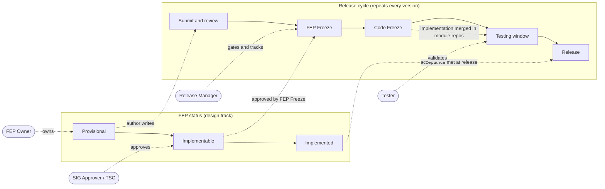

# FlagOS Community

<div align="center">

[](https://github.com/flagos-ai/community/milestone/1)
[](https://github.com/flagos-ai/community/milestone/2)
[](fep/README.md#-release-tracker)

**Language** | **语言**

[English](README.md) | [中文](README_CN.md)

</div>

---

## Welcome to FlagOS Community 👋

FlagOS is a unified, open-source AI system software stack designed for multi-chip scenarios. This community repository serves as the central hub for:

- 🤝 **Contributing** to FlagOS projects
- 💬 **Community discussions** and collaboration
- 📚 **Sharing knowledge** and best practices
- 🎯 **Participating** in the FlagOS ecosystem

## 🧭 Find Your Path

**New here? Start with your role — each row is the shortest path from "what you want" to "where to go."**

| I want to… | Role | Start here |
|------------|------|------------|
| **Propose a new feature** (cross-module, new chip, new repo) | Feature developer / FEP Owner | [FEP process](fep/README.md) → [authoring guide](contributors/fep-guide.md) → mind the [**2.2 FEP Freeze: 2026-08-14**](release/2.2/schedule.md) |
| **Onboard my chip** to FlagOS | Chip vendor | [Chip vendor guide](contributors/chip-vendor-guide.md) → example [FEP-0033 (SpacemiT)](fep/sig-operator/0033-flaggems-spacemit-backend.md) |
| **Fix a bug / send a small PR** | Code contributor | [CONTRIBUTING.md](CONTRIBUTING.md) → the target repo's own `CONTRIBUTING.md` |
| **Review FEPs** | SIG Approver / TSC | [Review guide](fep/REVIEW_GUIDE.md) → [FEP Tracker board](https://github.com/orgs/flagos-ai/projects/6/views/1?layout=board&groupedBy%5BcolumnId%5D=365272770) |
| **Test a release** | Tester / QA | [2.2 schedule](release/2.2/schedule.md) → [tracking issue #47](https://github.com/flagos-ai/community/issues/47) (test matrix compiled at FEP Freeze) |
| **Track release progress** | Release Manager / anyone | [🚩 Release Tracker](fep/README.md#-release-tracker) · [milestone/2](https://github.com/flagos-ai/community/milestone/2) |
| **Join or start a SIG** | New member / org | [sigs/](sigs/) → [roles](contributors/roles.md) |
| **Understand governance** | Everyone | [GOVERNANCE.md](GOVERNANCE.md) · [MAINTAINERS.md](MAINTAINERS.md) |

### How it all fits together

FlagOS development runs on three tracks at once — a FEP's **design status**, the **release cycle**, and **who acts when**. One picture:



- **FEP Owner** drives a proposal from `Provisional` to `Implemented`, and declares its `Target Version`.
- **SIG Approver / TSC** reviews the design and approves it to `Implementable` (with a complete Test Plan).
- **Release Manager** enforces the freeze dates and tracks progress via the milestone.
- **Tester** validates each merged FEP against its Test Plan during the testing window.

Full rules: [FEP lifecycle](fep/README.md#fep-lifecycle). Concrete dates for the current cycle: [release/2.2/schedule.md](release/2.2/schedule.md).

## Community Navigation

> The role router above is the fast path. This table is the full directory index.

| Section | Description |
|------|------|
| [GOVERNANCE.md](GOVERNANCE.md) | Governance rules & decision-making |
| [MAINTAINERS.md](MAINTAINERS.md) | TSC + SIG Chair roster |
| [sigs/](sigs/) | **SIGs** — list of all SIGs, charters, creation process, OWNERS spec, meeting calendar |
| [contributors/](contributors/) | Contributor guides, role definitions, FEP authoring |
| [fep/](fep/) | FEP process & templates |
| [release/](release/) | Release management process & per-version schedules |
| [wg/](wg/) | Incubating Working Groups |
| [CONTRIBUTING.md](CONTRIBUTING.md) | Contributor quick-nav |

## Table of Contents

- [About FlagOS Community](#about-flagos-community)
- [Find Your Path](#-find-your-path)
- [Community Navigation](#community-navigation)
- [How to Contribute](#how-to-contribute)
- [Communication Channels](#communication-channels)
- [Code of Conduct](#code-of-conduct)
- [Community Resources](#community-resources)
- [Getting Help](#getting-help)
- [License](#license)

## About FlagOS Community

FlagOS is jointly built by over ten domestic and international organizations, including chip companies, system manufacturers, algorithm and software entities, non-profit organizations, and research institutions. The FlagOS community aims to:

- **Break down ecosystem barriers** between different chip software stacks
- **Reduce migration costs** for developers
- **Foster innovation** in AI system software
- **Build an inclusive ecosystem** welcoming all contributors
- **Share knowledge** and promote best practices

The FlagOS project encompasses multiple specialized repositories:
- **[FlagGems](https://github.com/flagos-ai/FlagGems)** - High-performance universal AI operator library
- **[FlagTree](https://github.com/flagos-ai/flagtree)** - Unified AI compiler
- **[FlagScale](https://github.com/flagos-ai/FlagScale)** - Unified parallel training and inference framework
- **[FlagCX](https://github.com/flagos-ai/FlagCX)** - Unified communication library
- **[FlagPerf](https://github.com/flagos-ai/FlagPerf)** - Multi-chip evaluation tool
- And many more...

## How to Contribute

We welcome contributions from everyone! There are many ways to participate:

### 💻 Code Contributions
Help improve FlagOS by contributing code, bug fixes, and new features. See our [Contributing Guide](CONTRIBUTING.md) for details on:
- How to submit pull requests
- Code standards and formatting
- Running tests
- Code review process

### 📖 Documentation
Improve and expand documentation, examples, tutorials, and translations. Your improvements help make FlagOS accessible to more developers.

### 🐛 Bug Reports & Features
Report issues you encounter or suggest new features:
- **Bug Reports**: Help us fix problems by providing detailed reproduction steps
- **Feature Requests**: Share your ideas for improving FlagOS
- See [CONTRIBUTING.md](CONTRIBUTING.md) for templates and guidelines

### 🤝 Community Support
Join discussions and help other contributors:
- Answer questions in our communication channels
- Review pull requests and provide feedback
- Share knowledge and best practices
- Mentor new contributors

### 🏛️ Join or Create a SIG
SIGs (Special Interest Groups) are where technical work happens. Each SIG covers a specific domain — operators, compilers, networking, training, and more.
- **[Browse existing SIGs](sigs/)** to find one that matches your interests and attend a meeting
- **[Create a new SIG](GOVERNANCE.md#sig-special-interest-group)** — need ≥1 Chair, ≥1 Tech Lead, ≥3 members, and a charter. Submit a PR to get started

## Communication Channels

Stay connected and engage with the FlagOS community:

| Channel | Purpose | Contact |
|---------|---------|---------|
| 📧 **Email** | General inquiries and communication | contact@flagos.io |
| 📱 **WeChat Official Account** | Updates and news | 智源FlagOpen |
| 💬 **GitHub Discussions** | Technical discussions and Q&A | [Coming Soon] |
| 📋 **Mailing List** | Announcements and community updates | [Coming Soon] |

## Code of Conduct

We are committed to providing a welcoming and inclusive environment for all community members. All participants are expected to adhere to our Code of Conduct:

- **[Code of Conduct](CODE_OF_CONDUCT.md)** (English)

By participating in this community, you agree to uphold these standards and help us maintain a respectful and productive environment.

## Community Resources

- 📚 **[Contributing Guide](CONTRIBUTING.md)** - Detailed guidelines for contributing
- 🔗 **[FlagOS Wiki](https://flagos-wiki.baai.ac.cn/)** - Complete documentation and resources
- 📝 **[Project Roadmap](https://github.com/flagos-ai)** - See what we're building
- 🔗 **[Organization GitHub](https://github.com/flagos-ai)** - All FlagOS repositories
- 🌐 **Model Repositories**:
  - [ModelScope](https://modelscope.cn/organization/FlagRelease)
  - [Hugging Face](https://huggingface.co/FlagRelease/models)
  - [WiseModel](https://www.wisemodel.cn/models/FlagRelease/)

## Getting Help

### I'm new to FlagOS. Where do I start?
1. Read this README to understand the project
2. Check the [FlagOS Wiki](https://flagos-wiki.baai.ac.cn/) for comprehensive documentation
3. Review the [Contributing Guide](CONTRIBUTING.md) to learn how to contribute
4. Reach out on any of our [Communication Channels](#communication-channels)

### I want to contribute code. What should I do?
1. Identify which FlagOS repository is relevant to your contribution
2. Read that repository's specific `CONTRIBUTING.md` file
3. Review the [Community Contributing Guide](CONTRIBUTING.md) for general guidelines
4. Fork the repository and follow the contribution workflow
5. Submit your pull request for review

### I found a bug or have a feature idea. How do I report it?
1. Check existing issues to avoid duplicates
2. Open a new issue with:
   - Clear description of the problem/idea
   - Steps to reproduce (for bugs)
   - Relevant environment information
3. See [CONTRIBUTING.md](CONTRIBUTING.md) for detailed reporting guidelines

### I want to create or join a SIG
1. Browse the [SIG Overview](sigs/) to see existing SIGs and find one that matches your interests
2. To **join**: attend a SIG meeting (calendar in [sigs/](sigs/)) and introduce yourself
3. To **create** a new SIG: read the [SIG creation conditions](GOVERNANCE.md#sig-special-interest-group) in GOVERNANCE.md, then submit a PR with a charter draft + initial member list. TSC votes within 2 weeks
4. Check [Role Definitions](contributors/roles.md) to understand the Chair / Tech Lead / Approver roles

### I have a question or want to discuss something
Join any of our [Communication Channels](#communication-channels) and ask away! We have a supportive community ready to help.

## Repository Structure

```
community/
├── README.md                    # English version (this file)
├── README_CN.md                # Chinese version
├── GOVERNANCE.md               # Governance rules & decision making
├── MAINTAINERS.md              # TSC + SIG Chair roster
├── CODE_OF_CONDUCT.md          # Community code of conduct (English)
├── CODE_OF_CONDUCT_CN.md       # Community code of conduct (Chinese)
├── CONTRIBUTING.md             # Contribution quick-nav (English)
├── CONTRIBUTING_CN.md          # Contribution quick-nav (Chinese)
├── LICENSE                     # Apache License 2.0
├── sigs/                       # SIG charters, OWNERS, meetings
├── fep/                        # FEP process, template, review guide
├── contributors/               # Contributor guides (roles, dev-setup, etc.)
├── release/                    # Release management process & tools
└── wg/                         # Working Groups (incubation)
```

## License

This repository is licensed under the Apache License 2.0. See [LICENSE](LICENSE) for the full text.

---

## Thank You! 💖

We appreciate all contributions, no matter how small. Whether you're reporting a bug, submitting a feature request, improving documentation, or writing code - every contribution helps make FlagOS better.

**Ready to join us?** Start with the [Contributing Guide](CONTRIBUTING.md)!

---

<div align="center">

Chinese version: [中文版本](README_CN.md)

</div>
