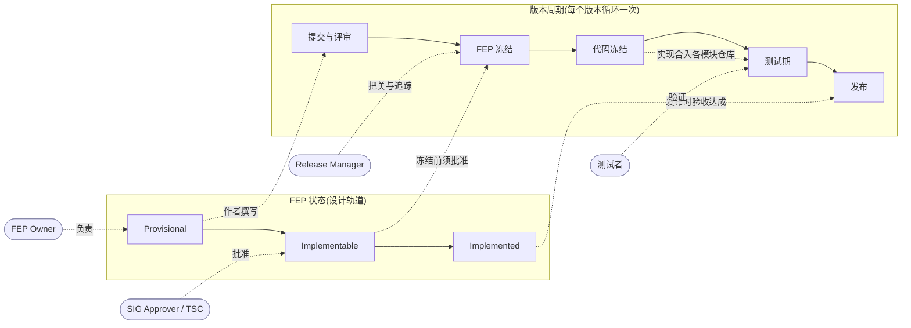

# FlagOS 社区

<div align="center">

[](https://github.com/flagos-ai/community/milestone/1)
[](https://github.com/flagos-ai/community/milestone/2)
[](fep/README_CN.md#-版本追踪-release-tracker)

**语言** | **Language**

[中文](README_CN.md) | [English](README.md)

</div>

---

## 欢迎来到 FlagOS 社区 👋

FlagOS 是一个统一的、开源的 AI 系统软件栈，专为多芯片场景设计。本社区仓库是以下工作的中心枢纽：

- 🤝 **为 FlagOS 项目贡献代码**
- 💬 **社区讨论和协作**
- 📚 **分享知识和最佳实践**
- 🎯 **参与 FlagOS 生态**

## 🧭 按角色找路

**初来乍到?从你的角色出发——每一行都是从"我想做什么"到"该去哪"的最短路径。**

| 我想… | 角色 | 从这里开始 |
|-------|------|-----------|
| **提交新特性**(跨模块、新芯片、新仓库) | 特性开发者 / FEP Owner | [FEP 流程](fep/README_CN.md) → [编写指引](contributors/fep-guide.md) → 注意 [**2.2 FEP 冻结:2026-08-15**](release/2.2/schedule_CN.md) |
| **让我的芯片接入** FlagOS | 芯片厂商 | [芯片厂商指南](contributors/chip-vendor-guide.md) → 范例 [FEP-0033(SpacemiT)](fep/sig-operator/0033-flaggems-spacemit-backend.md) |
| **修 bug / 提小 PR** | 代码贡献者 | [CONTRIBUTING.md](CONTRIBUTING_CN.md) → 目标仓库自己的 `CONTRIBUTING.md` |
| **评审 FEP** | SIG Approver / TSC | [评审指南](fep/REVIEW_GUIDE.md) → [FEP Tracker 看板](https://github.com/orgs/flagos-ai/projects/6/views/1?layout=board&groupedBy%5BcolumnId%5D=365272770) |
| **参与版本测试** | 测试者 / QA | [2.2 时间表](release/2.2/schedule_CN.md) → [追踪 issue #47](https://github.com/flagos-ai/community/issues/47)(测试矩阵在 FEP 冻结日汇编) |
| **了解版本进度** | Release Manager / 任何人 | [🚩 版本追踪](fep/README_CN.md#-版本追踪-release-tracker) · [milestone/2](https://github.com/flagos-ai/community/milestone/2) |
| **加入或创建 SIG** | 新成员 / 组织 | [sigs/](sigs/) → [角色定义](contributors/roles_CN.md) |
| **了解治理机制** | 所有人 | [GOVERNANCE.md](GOVERNANCE_CN.md) · [MAINTAINERS.md](MAINTAINERS.md) |

### 全局一张图

FlagOS 的开发同时跑在三条轨道上——FEP 的**设计状态**、**版本周期**、以及**各角色何时行动**:



- **FEP Owner**:推动提案从 `Provisional` 走到 `Implemented`,并申报 `Target Version`。
- **SIG Approver / TSC**:评审设计,批准至 `Implementable`(要求 Test Plan 完整)。
- **Release Manager**:执行冻结日期,通过 milestone 追踪进度。
- **测试者**:在测试期依据各 FEP 的 Test Plan 验证已合入的功能。

完整规则:[FEP 生命周期](fep/README_CN.md#fep-生命周期)。当前周期的具体日期见:[release/2.2/schedule_CN.md](release/2.2/schedule_CN.md)。

## 社区导航

> 上面的角色路由是快捷路径,下表是完整的目录索引。

| 入口 | 说明 |
|------|------|
| [GOVERNANCE_CN.md](GOVERNANCE_CN.md) | 社区治理规则与决策机制 |
| [MAINTAINERS.md](MAINTAINERS.md) | TSC + SIG Chair 名单 |
| [sigs/](sigs/) | **SIG** — 所有 SIG 列表、章程、创建流程、OWNERS 规范、会议日历 |
| [contributors/](contributors/) | 贡献者指南、角色定义、FEP 编写指引 |
| [fep/](fep/) | FEP 流程与模板 |
| [release/](release/) | 版本发布管理流程与各版本时间表 |
| [wg/](wg/) | 孵化工作组 |
| [CONTRIBUTING.md](CONTRIBUTING_CN.md) | 贡献者快速导航 |

## 目录

- [关于 FlagOS 社区](#关于-flagos-社区)
- [按角色找路](#-按角色找路)
- [社区导航](#社区导航)
- [如何贡献](#如何贡献)
- [交流渠道](#交流渠道)
- [行为准则](#行为准则)
- [社区资源](#社区资源)
- [获取帮助](#获取帮助)
- [许可证](#许可证)

## 关于 FlagOS 社区

FlagOS 由十多家国内外组织联合建立，包括芯片公司、系统制造商、算法和软件实体、非营利组织和研究机构。FlagOS 社区的目标是：

- **打破生态壁垒** - 消除不同芯片软件栈之间的障碍
- **降低迁移成本** - 帮助开发者轻松切换芯片平台
- **促进创新** - 推动 AI 系统软件的发展
- **构建包容生态** - 欢迎所有贡献者参与
- **分享知识** - 推广最佳实践和经验

FlagOS 项目包含多个专业化的代码仓库：
- **[FlagGems](https://github.com/flagos-ai/FlagGems)** - 高性能通用 AI 算子库
- **[FlagTree](https://github.com/flagos-ai/flagtree)** - 统一 AI 编译器
- **[FlagScale](https://github.com/flagos-ai/FlagScale)** - 统一并行训练推理框架
- **[FlagCX](https://github.com/flagos-ai/FlagCX)** - 统一通信库
- **[FlagPerf](https://github.com/flagos-ai/FlagPerf)** - 多芯片评测工具
- 以及更多项目...

## 如何贡献

我们欢迎所有人的贡献！参与的方式有很多：

### 💻 代码贡献
通过贡献代码、修复 bug 和实现新功能来改进 FlagOS。详见[贡献指南](CONTRIBUTING_CN.md)：
- 如何提交 Pull Request
- 代码规范和格式
- 运行测试
- 代码审查流程

### 📖 文档贡献
改进和完善文档、示例、教程和翻译。您的贡献有助于让更多开发者了解 FlagOS。

### 🐛 Bug 报告和功能建议
报告您发现的问题或提出改进建议：
- **Bug 报告** - 通过详细的复现步骤帮助我们修复问题
- **功能请求** - 分享您对改进 FlagOS 的想法
- 详见[贡献指南](CONTRIBUTING_CN.md)中的模板和指南

### 🤝 社区支持
加入讨论并帮助其他贡献者：
- 在交流渠道中回答问题
- 审查 Pull Request 并提供反馈
- 分享知识和最佳实践
- 指导新贡献者

### 🏛️ 加入或创建 SIG
SIG（特别兴趣小组）是技术工作的核心组织。每个 SIG 覆盖一个特定技术领域——算子、编译器、通信、训练等。
- **[浏览现有 SIG](sigs/)** 找到你感兴趣的方向，参加例会
- **[创建新 SIG](GOVERNANCE_CN.md#sig-special-interest-group)** — 需 ≥1 名 Chair、≥1 名 Tech Lead、≥3 名初始成员、Charter 草案。向 TSC 提交 PR 即可发起

## 交流渠道

与 FlagOS 社区保持联系和互动：

| 渠道 | 目的 | 联系方式 |
|------|------|--------|
| 📧 **邮箱** | 一般咨询和沟通 | contact@flagos.io |
| 📱 **微信公众号** | 更新和新闻 | 智源FlagOpen |
| 📺 **微信视频号** | 视频更新和公告 | 智源FlagOpen |
| 💬 **GitHub Discussions** | 技术讨论和问答 | [flagos-ai/community/discussions](https://github.com/flagos-ai/community/discussions) |
| 📋 **邮件列表** | 公告和社区更新 | [即将推出] |

## 行为准则

我们致力于为所有社区成员提供热情和包容的环境。所有参与者都应遵守我们的行为准则：

- **[行为准则](CODE_OF_CONDUCT_CN.md)** (中文)

通过参与本社区，您同意遵守这些标准，并帮助我们维持一个尊重和高效的环境。

## 社区资源

- 📚 **[贡献指南](CONTRIBUTING_CN.md)** - 详细的贡献指南
- 🔗 **[FlagOS Wiki](https://flagos-wiki.baai.ac.cn/)** - 完整的文档和资源
- 📝 **[项目路线图](https://github.com/flagos-ai)** - 了解我们的规划
- 🔗 **[组织 GitHub](https://github.com/flagos-ai)** - 所有 FlagOS 代码仓
- 🌐 **模型仓库**：
  - [ModelScope](https://modelscope.cn/organization/FlagRelease)
  - [Hugging Face](https://huggingface.co/FlagRelease/models)
  - [WiseModel](https://www.wisemodel.cn/models/FlagRelease/)

## 获取帮助

### 我是 FlagOS 的新手。从哪里开始？
1. 阅读本 README 了解项目
2. 查看 [FlagOS Wiki](https://flagos-wiki.baai.ac.cn/) 获取详细文档
3. 阅读[贡献指南](CONTRIBUTING_CN.md)了解如何参与
4. 在我们的任何[交流渠道](#交流渠道)上联系我们

### 我想贡献代码。应该怎么做？
1. 找到与您的贡献相关的 FlagOS 仓库
2. 阅读该仓库特定的 `CONTRIBUTING.md` 文件
3. 查看[社区贡献指南](CONTRIBUTING_CN.md)了解一般准则
4. Fork 该仓库并按照贡献工作流操作
5. 提交您的 Pull Request 接受审查

### 我发现了一个 bug 或有功能建议。如何报告？
1. 检查现有问题以避免重复
2. 创建新 issue，包括：
   - 问题/建议的清晰描述
   - 复现步骤（针对 bug）
   - 相关的环境信息
3. 详见[贡献指南](CONTRIBUTING_CN.md)中的详细报告指南

### 我想创建或加入 SIG
1. 浏览 [SIG 总览](sigs/) 查看现有 SIG，找到你感兴趣的方向
2. **加入**：参加 SIG 例会（日历见 [sigs/](sigs/)）并做自我介绍
3. **创建**新 SIG：阅读 [SIG 创建条件](GOVERNANCE_CN.md#sig-special-interest-group)，然后提交 PR（含 Charter 草案 + 初始成员名单）。TSC 在 2 周内投票决定
4. 查看 [角色定义](contributors/roles_CN.md) 了解 Chair / Tech Lead / Approver 等角色的职责

### 我有问题或想讨论某个话题
加入我们的任何[交流渠道](#交流渠道)提问！我们有一个热心的社区随时准备帮助。

## 仓库结构

```
community/
├── README.md                    # 英文版本
├── README_CN.md                # 中文版本（本文件）
├── GOVERNANCE.md               # 治理规则与决策机制
├── MAINTAINERS.md              # TSC + SIG Chair 名单
├── CODE_OF_CONDUCT.md          # 社区行为准则（英文）
├── CODE_OF_CONDUCT_CN.md       # 社区行为准则（中文）
├── CONTRIBUTING.md             # 贡献者快速导航（英文）
├── CONTRIBUTING_CN.md          # 贡献者快速导航（中文）
├── LICENSE                     # Apache License 2.0
├── sigs/                       # SIG 章程、OWNERS、会议记录
├── fep/                        # FEP 流程、模板、评审指南
├── contributors/               # 贡献者指南（角色、环境搭建等）
├── release/                    # 发布管理流程与工具
└── wg/                         # 孵化工作组
```

## 许可证

本仓库采用 Apache License 2.0 许可。详见 [LICENSE](LICENSE) 文件。

---

## 感谢您！ 💖

我们感谢所有的贡献，无论大小。无论您是报告 bug、提交功能建议、改进文档还是编写代码——每个贡献都在帮助 FlagOS 变得更好。

**准备好加入我们了吗？** 从[贡献指南](CONTRIBUTING_CN.md)开始吧！

---

<div align="center">

英文版本：[English Version](README.md)

</div>
