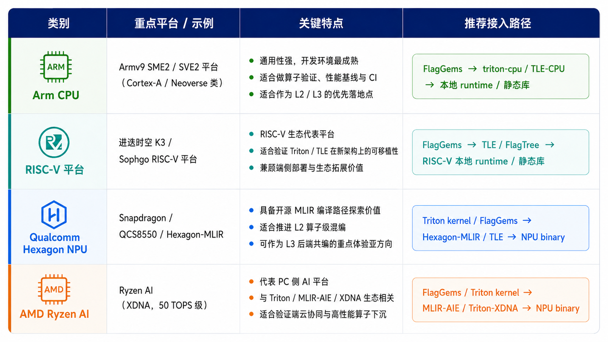
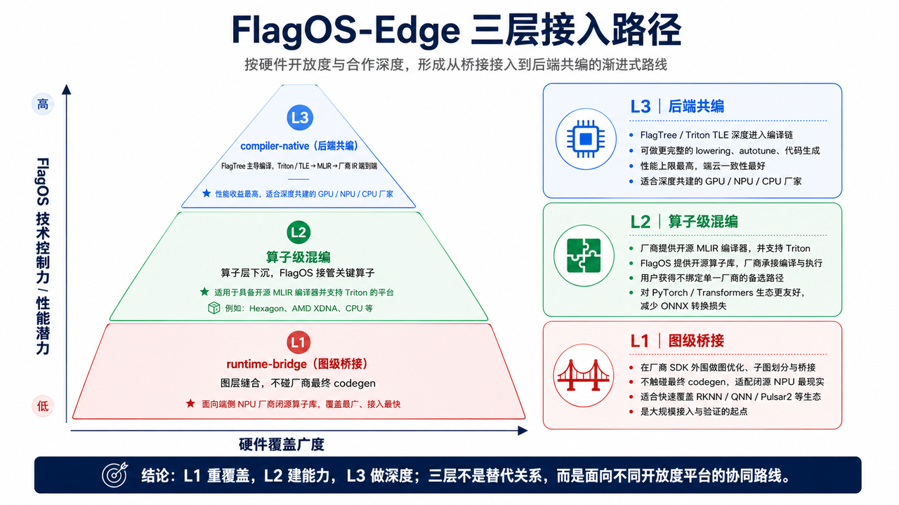
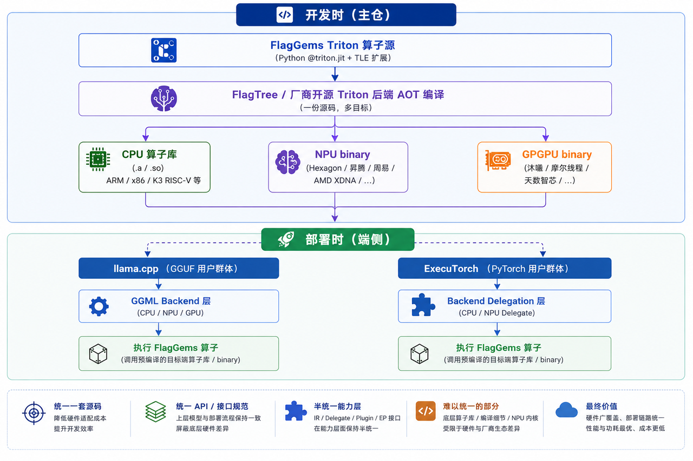
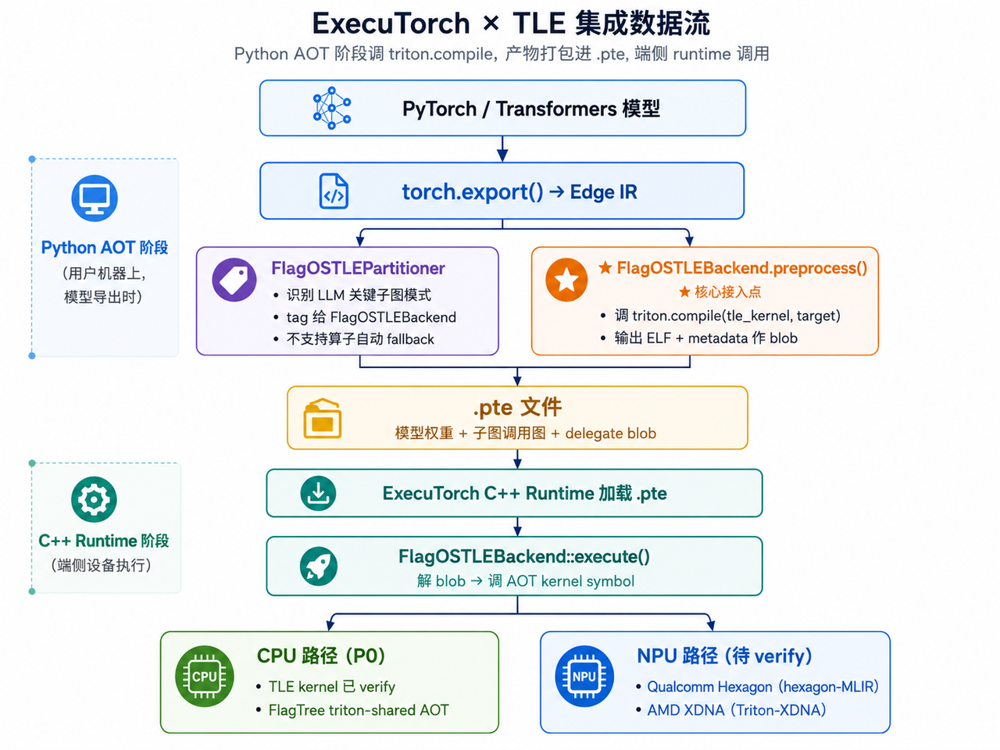
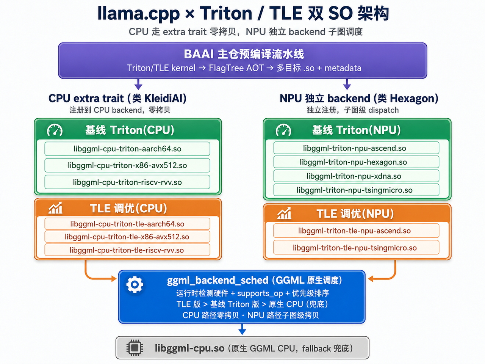

# sig-edge: Edge-Side Hardware and SDK (Planned)

## Reason for Deferred Activation

The edge ecosystem has not yet taken shape; no Chair candidate or standing member roster has been identified, and there are no clearly identifiable contributors or users in the edge domain yet.

## Planned Responsibilities

- Edge-side hardware adaptation (CPU, NPU, IoT devices, etc.)
- Edge-side inference optimization
- Edge-side SDK and examples
- Coordination with chip-level adaptation (sig-chip) and OS-level packaging (sig-os) for edge targets

## Current Interim Arrangement

The "edge" track is temporarily hosted as a sub-project of sig-chip. Cross-module edge FEPs are reviewed directly by the TSC per the bootstrap note in [fep/README.md](../../fep/README.md); edge-specific changes land as merged PRs in the relevant Flag* repositories under their owning SIGs.

## Technical Approach (Draft)

> The following diagrams sketch the proposed edge onboarding routes and toolchain. They are a working reference for the interim sig-chip edge sub-project, not a frozen design.

### Platform Onboarding Matrix

Target platforms, their distinguishing features, and the recommended onboarding route per platform (Arm CPU, RISC-V, Qualcomm Hexagon NPU, AMD Ryzen AI).

### Three-Layer Onboarding Path

Edge integration generally happens at three levels. From the community side we encourage starting integration at **Level 2 — runtime collaboration**: here the silicon vendor offers an open-source MLIR compiler as the entry point to integrate with FlagOS. **Level 1** integration is out of scope for this group, as it implies a closed-source software stack. **Level 3** is the most preferred form, with Triton-TLE support for both CPU and NPU; this is where the closer, compiler-level collaboration takes place. For more detail on integration, see the [FlagOS 南向芯片适配指南](https://jwolpxeehx.feishu.cn/file/YJ7WbGdlbodRExxSYBXcsrNGnHh?from=from_copylink).

### Development-to-Deployment Flow

The flow is anchored on two building blocks from the main repositories: the **operator library (FlagGems)**, written as Triton kernels, and the **compiler (FlagTree)**, which compiles those kernels ahead-of-time (AOT) for each vendor target. AOT compilation turns the Python-level operators into per-target artifacts — a CPU operator library, an NPU binary, or a GPGPU binary — that carry no Python or JIT dependency at runtime.

These prebuilt artifacts are then consumed on-device through the **AOT integration path** of two inference engines: llama.cpp, where FlagGems operators are plugged in behind the GGML backend, and ExecuTorch, where they are wired in through backend delegation. The same operator-plus-compiler output thus serves both engines without re-authoring kernels per backend.

### Deployment Paths (Draft)

The AOT-compiled operators feed two complementary deployment runtimes; both reuse the same FlagGems / Triton-TLE artifacts and split work across CPU and NPU backends.

**Path A — ExecuTorch × TLE.** The framework runtime route: `torch.export()` → Edge IR → `.pte`, loaded by the ExecuTorch C++ runtime and dispatched to a CPU backend (TLE) and an NPU backend (Hexagon / XDNA).

**Path B — llama.cpp × Triton / TLE.** A dual-`.so` architecture for the llama.cpp route: the CPU and NPU backends are built as separate shared objects, with Triton/TLE-generated kernels sitting behind the GGML backend scheduler.

