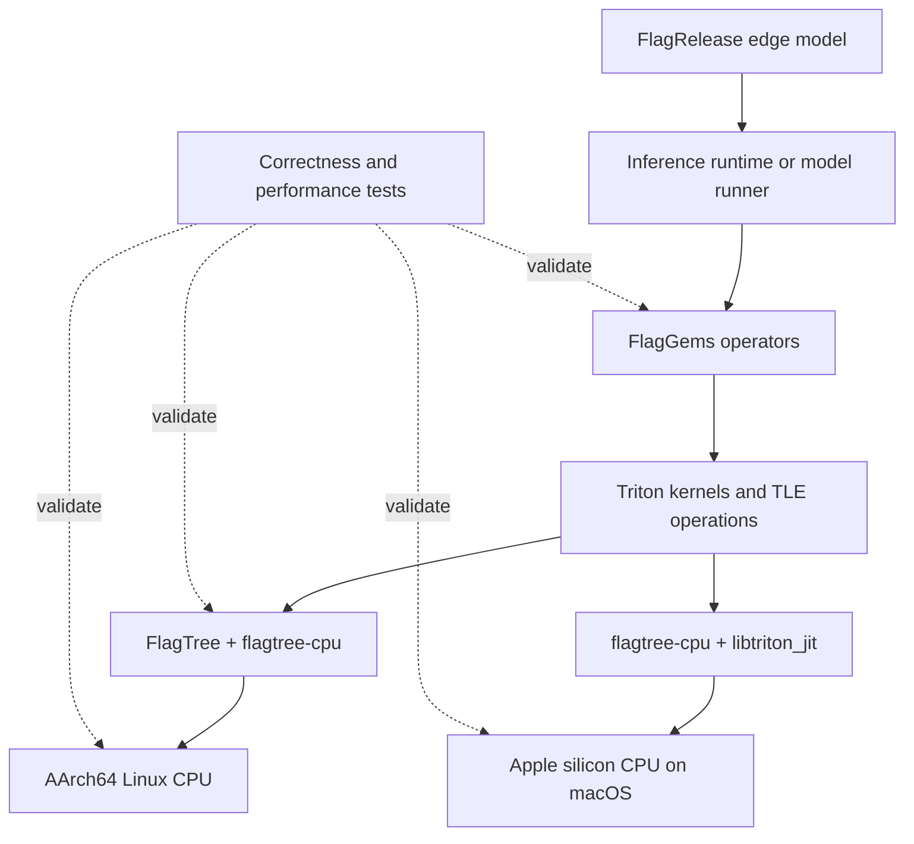
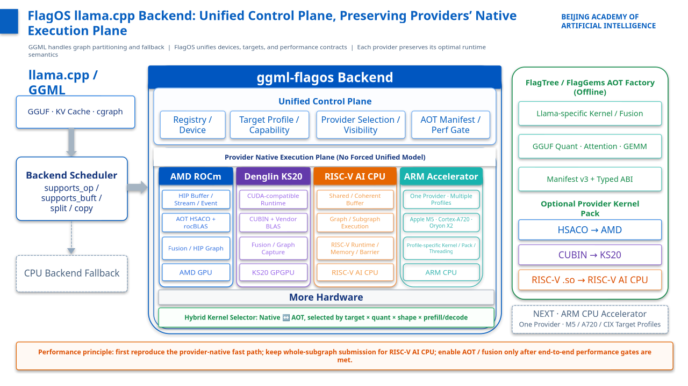
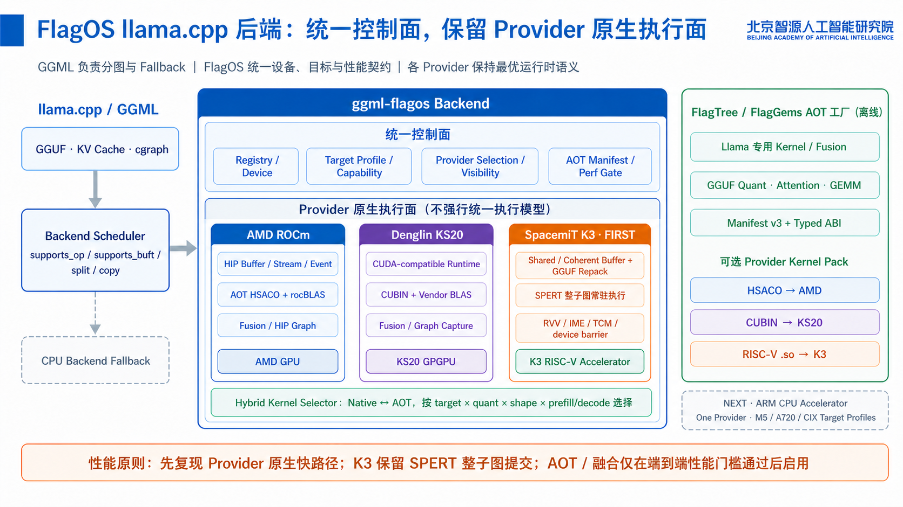
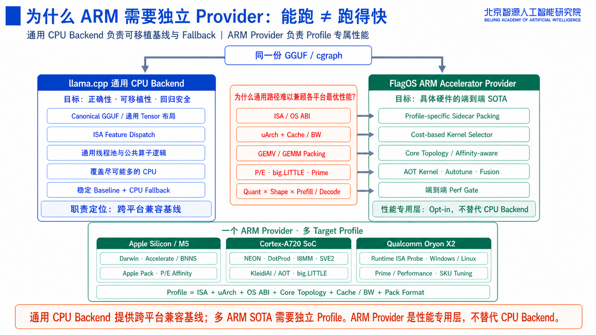
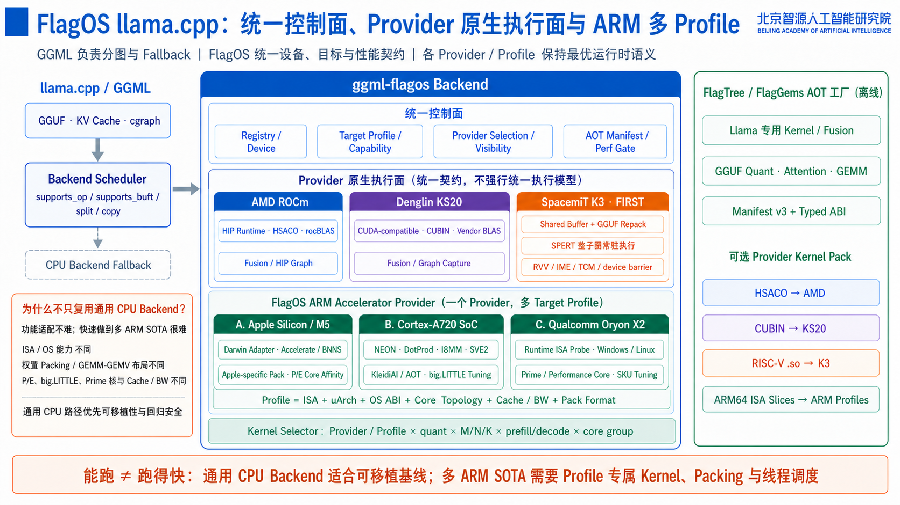

# sig-edge: FlagOS Edge

sig-edge coordinates edge inference work across the FlagOS community. The SIG focuses on making FlagOS compiler and operator technologies usable on resource-constrained devices while keeping hardware-specific code in the repositories that own it.

The first FEP-validated platform is **AArch64 Linux CPU**, delivered through FlagTree, flagtree-cpu, and FlagGems. FlagOS also publishes edge-specific model packages and a developer runtime for macOS on Apple silicon.

> There is currently no single cross-platform `flagos-edge` SDK. This repository contains the SIG charter and design records; implementation code, model packages, and platform runtimes live in the projects listed below.

## Quick Links

- [Current support](#current-support)
- [FlagRelease edge models](#flagrelease-edge-models)
- [Architecture](#architecture)
- [Inference engine integration](#inference-engine-integration)
- [Getting started](#getting-started)
- [Projects](#projects)
- [Roadmap](#roadmap)
- [Contributing](#contributing)
- [Edge FEPs](../../fep/sig-edge/)
- [Meeting notes](meetings/)

## Current Support

| Platform | Status | Implementation | Validation |
|---|---|---|---|
| AArch64 Linux CPU | Implemented | FlagTree CPU backend, flagtree-cpu, FlagGems Arm backend, and TLE operations | [FEP-0015](../../fep/sig-edge/0015-arm64-cpu-backend-flagtree-tle.md) |
| macOS arm64, Apple M5 Pro | Developer release | CPU-only FlagOS macOS W4A8 Runtime with vLLM, vLLM-Plugin-FL, FlagGems, flagtree-cpu, and native Arm operators | [Runtime](https://github.com/kevinzs2048/flagos-macos-runtime) and [Qwen3.8 model card](https://huggingface.co/FlagRelease/Qwen3.8-27B-W4A8-arm-FlagOS-Express) |

`Implemented` means that the corresponding FEP has met its documented acceptance criteria. `Developer release` is a published, reproducible runtime for the configuration named in the table, but is not a general support claim for all macOS or Apple silicon systems.

Each linked FEP, runtime, or model card defines its tested environment and known limitations.

## FlagRelease Edge Models

The following model packages are the current FlagRelease edge models. Their model cards are the source of truth for weights, supported execution paths, setup instructions, and validation results.

| Model | Validated edge path | Model links | Runtime / guide |
|---|---|---|---|
| `Qwen3.8-27B-W4A8-arm-FlagOS-Express` | GPTQ packed W4A8 G128; macOS arm64 on Apple M5 Pro; CPU-only, text-only inference | [ModelScope](https://modelscope.cn/models/FlagRelease/Qwen3.8-27B-W4A8-arm-FlagOS-Express) · [Hugging Face](https://huggingface.co/FlagRelease/Qwen3.8-27B-W4A8-arm-FlagOS-Express) | [FlagOS macOS W4A8 Runtime](https://github.com/kevinzs2048/flagos-macos-runtime) |
| `MiniCPM5-1B-Armv9-FlagOS` | AArch64 Linux CPU; BF16 and dynamic W8A8 inference | [Hugging Face](https://huggingface.co/FlagRelease/MiniCPM5-1B-Armv9-FlagOS) | [Model card and container guide](https://huggingface.co/FlagRelease/MiniCPM5-1B-Armv9-FlagOS) |

A listed model applies only to its linked package and documented configuration. It does not imply that every feature of the upstream model is enabled on every edge runtime.

## Architecture

The current Arm CPU paths extend the existing FlagOS compiler and operator stack. Platform runtimes package those components for a specific operating system, model, and tested hardware configuration.

The main design rules are:

- Reuse FlagOS compiler and operator projects rather than creating a parallel stack.
- Keep platform-specific implementation behind clear compiler, runtime, or operator boundaries.
- Preserve a correct fallback when an optimized path is unavailable.
- Measure end-to-end workloads in addition to individual kernels.
- Record supported configurations and reproducible tests in FEPs.

## Inference Engine Integration

> This section describes the integration direction. Support claims remain subject to the FEP and validation requirements of this SIG.

### Why FlagOS Integrates with llama.cpp

[llama.cpp](https://github.com/ggml-org/llama.cpp) and the GGUF model format are foundational components of the on-device AI ecosystem. A growing number of chip vendors want to expose their hardware through llama.cpp. Given finite upstream review and maintenance capacity, however, it is difficult for the community to continuously absorb, validate, and tune every vendor-specific backend. Vendors therefore often rely on long-lived out-of-tree integrations and must repeatedly rebase their code, track upstream changes, and carry the compatibility burden themselves. The FlagOS backend addresses this fragmentation through a stable multi-provider integration layer: hardware vendors can reuse GGML graph scheduling, device and buffer abstractions, capability checks, data movement, and CPU fallback while retaining their provider-native runtime and execution semantics.

Performance is a first-class contract of this integration, not an afterthought. FlagOS does not force different processors through a lowest-common-denominator executor. Each provider can preserve its native fast path, including AOT kernels and vendor libraries, hardware-specific weight repacking, graph or subgraph execution, operator fusion, and graph capture. A performance-aware selector can choose implementations by hardware target, quantization format, tensor shape, and prefill or decode phase, while end-to-end performance gates prevent a locally faster kernel from being enabled when it regresses model-level latency, throughput, memory usage, or synchronization cost. This gives new hardware a reusable path into llama.cpp without giving up the specialization required for competitive performance.

  

The following detailed architecture view shows how the unified control plane coordinates provider-native execution paths, offline AOT kernel packages, and end-to-end performance gates:

  

### Why a Dedicated ARM Provider?

ARM is not a single homogeneous performance target. Apple silicon, Cortex-A720-based SoCs, and Qualcomm Oryon processors differ substantially in instruction-set extensions, operating-system ABI, cache hierarchy, memory bandwidth, heterogeneous core topology, and the weight layouts and thread schedules that are optimal for GEMV-heavy decode versus GEMM-heavy prefill. The generic llama.cpp CPU backend remains the portable compatibility baseline and a reliable fallback; it can provide broad functional coverage, but rapidly reaching and sustaining state-of-the-art performance across these different ARM platforms requires profile-specific kernels, sidecar packed weights, runtime ISA probing, affinity-aware scheduling, and per-shape tuning. A dedicated, opt-in FlagOS ARM provider supplies that performance-specialization layer without replacing or weakening the generic CPU backend.

  

The ARM provider uses multiple target profiles so that each platform can retain its ISA, microarchitecture, operating-system ABI, core-topology, cache and bandwidth, packing-format, and scheduling optimizations:

  

## Getting Started

### AArch64 Linux

The FEP-validated Linux path requires AArch64 Linux and a source build.

1. Review the [platform requirements](../../fep/sig-edge/0015-arm64-cpu-backend-flagtree-tle.md#platform-requirements).
2. Follow the [FEP-0015 build instructions](../../fep/sig-edge/0015-arm64-cpu-backend-flagtree-tle.md#packaging) to build FlagTree, connect flagtree-cpu, and install FlagGems.
3. Run the [FEP-0015 test plan](../../fep/sig-edge/0015-arm64-cpu-backend-flagtree-tle.md#test-plan).
4. When reporting a result, include the hardware, operating system, compiler revision, model, precision, commands, and complete output.

The FEP is the source of truth for the tested software versions and acceptance criteria. Project READMEs may describe newer development configurations.

### macOS on Apple Silicon

For the validated Qwen3.8-27B W4A8 path on Apple M5 Pro:

1. Read the [Qwen3.8 model card](https://modelscope.cn/models/FlagRelease/Qwen3.8-27B-W4A8-arm-FlagOS-Express) for the supported checkpoint layout and inference command.
2. Install or build the [FlagOS macOS W4A8 Runtime](https://github.com/kevinzs2048/flagos-macos-runtime).
3. Use the packaged standard `vllm` CLI to serve the model.

The current developer release is CPU-only and does not use Metal or GPU offload. Refer to the Runtime repository for its exact supported Mac model, release version, checksums, and benchmark protocol.

## Projects

| Project | Responsibility |
|---|---|
| [FlagTree](https://github.com/flagos-ai/FlagTree) | Compiler frontend, backend selection, lowering, and TLE integration |
| [flagtree-cpu](https://github.com/flagos-ai/flagtree-cpu) | Experimental Triton CPU backend and CPU-specific runtime/compiler support |
| [FlagGems](https://github.com/flagos-ai/FlagGems) | Portable operators, fused operations, quantized inference paths, and backend dispatch |
| [flagos-macos-runtime](https://github.com/kevinzs2048/flagos-macos-runtime) | Self-contained developer runtime for the validated Qwen3.8-27B W4A8 path on Apple M5 Pro |
| [community](https://github.com/flagos-ai/community) | SIG governance, FEPs, release tracking, and cross-project coordination |

Changes should be submitted to the repository responsible for the affected layer. sig-edge coordinates cross-repository design and acceptance; it is not a replacement code repository.

## Scope

### In Scope

- Edge CPU, NPU, GPU, APU, and other accelerator enablement
- Edge inference compiler, operator, runtime, and packaging requirements
- Hardware capability detection and fallback behavior
- End-to-end correctness and performance validation
- Reproducible examples, compatibility information, and deployment documentation
- Coordination of changes spanning multiple FlagOS repositories

### Out of Scope or Shared Ownership

| Area | Primary community group | sig-edge role |
|---|---|---|
| General compiler infrastructure | [sig-compiler](../sig-compiler/) | Defines edge requirements and reviews edge-specific integration |
| General operator libraries | [sig-operator](../sig-operator/) | Coordinates edge operators and workload validation |
| Framework adapters | [sig-framework](../sig-framework/) | Coordinates framework-facing edge requirements |
| Datacenter accelerators | [sig-chip](../sig-chip/) | Reuses backend work where it also applies to edge devices |
| OS packaging and distributions | [sig-os](../_planned/sig-os.md) | Coordinates packaging requirements |
| RISC-V architecture experiments | [sig-riscv](../_planned/sig-riscv.md) | Coordinates edge workloads after architecture support is validated |
| Embodied-AI scenarios | [wg-embodied](../../wg/wg-embodied/) | Coordinates workload and end-to-end acceptance requirements |

## Roadmap

The near-term direction is to make the implemented AArch64 path easier to build, test, and maintain before claiming broader platform coverage.

| Area | Direction |
|---|---|
| Build and installation | Reduce source-build complexity and document supported version combinations |
| Continuous integration | Maintain reproducible correctness tests on representative edge hardware |
| Packaging | Define deployable artifacts that do not require a Python or JIT environment on the target device |
| Workloads | Add small, reproducible end-to-end model examples and benchmark procedures |
| Additional hardware | Evaluate through new FEPs with maintainers, CI access, code, and acceptance evidence |
| Runtime integration | Add integrations only when an implementation, owner, tests, and user documentation are available |

Roadmap items are not release commitments. Accepted FEPs and their linked tracking issues are the source of truth for scheduled work.

## Edge FEPs

| FEP | Status | Summary |
|---|---|---|
| [FEP-0015: Arm64 CPU Backend for FlagOS](../../fep/sig-edge/0015-arm64-cpu-backend-flagtree-tle.md) | `Implemented` | AArch64 Linux CPU compilation and inference using FlagTree, flagtree-cpu, FlagGems, and TLE |

New significant features, repositories, or hardware platforms require a FEP. See the [FEP process](../../fep/README.md) and [authoring guide](../../contributors/fep-guide.md).

## Contributing

Contributions are welcome in compiler support, operators, documentation, examples, testing, and hardware enablement.

### Small or Single-Repository Changes

Open an issue or pull request in the repository that owns the code. Follow that repository's contribution guide and include tests appropriate to the change.

### Cross-Repository Features and New Platforms

Start with a community issue or FEP. A useful proposal includes:

- The target device, operating system, SDK, and public documentation
- A maintainer for the implementation
- Access to development and CI hardware
- A minimal model or workload with a correct baseline
- Clear acceptance criteria and a reproducible test plan
- Known licensing, redistribution, and upstreaming constraints

Do not add a platform to the support table until its FEP and acceptance evidence are complete.

### Reporting Performance

Performance reports should include:

- Exact hardware and power/performance mode
- Operating system, SDK, compiler, and repository revisions
- Model, input shape, precision, and quantization method
- Warm-up and measurement procedure
- Correctness or quality checks
- Baseline and full reproduction commands

## Governance and Communication

- **Ownership and approvals:** [OWNERS](./OWNERS)
- **Community maintainer roster:** [MAINTAINERS.md](../../MAINTAINERS.md)
- **Meeting notes:** [meetings/](meetings/)
- **GitHub Discussions:** [flagos-ai/community](https://github.com/flagos-ai/community/discussions)
- **Contact:** contact@flagos.io

Routine changes follow the owning repository's review process. Cross-project FEPs require review from the affected SIGs. Unresolved decisions escalate to the FlagOS TSC under the [community governance](../../GOVERNANCE.md).

## License

SIG documentation in this repository is licensed under the [Apache License 2.0](../../LICENSE). Source code remains under the license of its owning repository.
